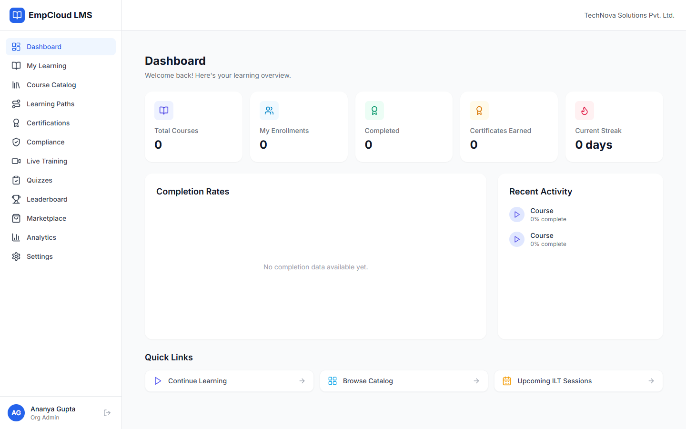

# EMP Cloud

**The core HRMS platform, identity server, and module gateway for the EMP ecosystem.**

[]()
[](LICENSE)

EMP Cloud is both the central identity/subscription platform AND the core HRMS application. It provides centralized authentication (OAuth2/OIDC), organization management, module subscriptions with seat-based licensing, and built-in HRMS features including employee profiles, attendance, leave, documents, announcements, company policies, org chart visualization, notification center, bulk CSV import, employee self-service dashboard, unified dashboard widgets, super admin dashboard, onboarding wizard, and online payment processing. Sellable modules (Payroll, Monitor, Recruit, etc.) connect via OAuth2, SSO token exchange, and subdomain routing.

## Scale

| Metric | Count |
|--------|-------|
| Database tables | ~180+ across 9+ databases |
| API endpoints | ~500+ |
| Frontend pages | ~200+ |
| Automated tests | 2,000+ (79 E2E + 109 security + unit tests) |
| GitHub repositories | 10 |
| Modules deployed to test server | 10 |
| AI agent tools | 41 |
| Languages supported | 9 |

## Architecture

```
empcloud.com                    <- EMP Cloud (core HRMS + identity + gateway)
|   Built-in: Employee Profiles, Attendance, Leave, Documents,
|             Announcements, Policies, Org Chart, Notifications,
|             Bulk Import, Self-Service Dashboard, Unified Widgets,
|             Super Admin Dashboard, Onboarding Wizard, AI Agent, API Docs
|
|- payroll.empcloud.com         <- EMP Payroll (sellable module)
|- monitor.empcloud.com         <- EMP Monitor (sellable module)
|- recruit.empcloud.com         <- EMP Recruit (sellable module)
|- field.empcloud.com           <- EMP Field (sellable module)
|- biometrics.empcloud.com      <- EMP Biometrics (sellable module)
|- projects.empcloud.com        <- EMP Projects (sellable module)
|- rewards.empcloud.com         <- EMP Rewards (sellable module)
|- performance.empcloud.com     <- EMP Performance (sellable module)
|- exit.empcloud.com            <- EMP Exit (sellable module)
|- lms.empcloud.com             <- EMP LMS (sellable module)
```

### Design Principles

- **EMP Cloud IS the core HRMS** — Attendance, Leave, Employee Profiles, Documents, Announcements, and Policies are built directly into EMP Cloud, not separate modules
- **EMP Billing is internal** — It powers subscription invoicing behind the scenes; it is NOT a sellable module in the marketplace
- **10 sellable modules** in the marketplace — Payroll, Monitor, Recruit, Field, Biometrics, Projects, Rewards, Performance, Exit, LMS
- **OAuth2/OIDC Authorization Server** — SOC 2 compliant, RS256 asymmetric signing, PKCE for SPAs
- **SSO via sso_token URL parameter** — Cross-module SSO uses a short-lived sso_token passed as a URL parameter for seamless authentication across subdomains
- **Single MySQL instance, separate databases** — `empcloud` (identity + HRMS + subscriptions), `emp_payroll`, `emp_monitor`, `emp_lms`, etc.
- **Subdomain-based module routing** — Each sellable module is an independent app with its own URL
- **Seat-based subscriptions** — Orgs subscribe to modules with allocated seats per module
- **Payroll fetches from Cloud** — EMP Payroll retrieves attendance and leave data from EMP Cloud via service APIs, not its own tables
- **Online payment integration** — Stripe, Razorpay, and PayPal for invoice payments

## Test Deployment URLs

All modules are deployed to the test environment:

| Module | Frontend URL | API URL |
|--------|-------------|---------|
| EMP Cloud | https://test-empcloud.empcloud.com | https://test-empcloud-api.empcloud.com |
| EMP Recruit | https://test-recruit.empcloud.com | https://test-recruit-api.empcloud.com |
| EMP Performance | https://test-performance.empcloud.com | https://test-performance-api.empcloud.com |
| EMP Rewards | https://test-rewards.empcloud.com | https://test-rewards-api.empcloud.com |
| EMP Exit | https://test-exit.empcloud.com | https://test-exit-api.empcloud.com |
| EMP LMS | https://testlms.empcloud.com | https://testlms-api.empcloud.com |
| EMP Payroll | https://testpayroll.empcloud.com | https://testpayroll-api.empcloud.com |
| EMP Project | https://test-project.empcloud.com | https://test-project-api.empcloud.com |
| EMP Monitor | https://test-empmonitor.empcloud.com | https://test-empmonitor-api.empcloud.com |
| EMP Billing | (internal, port 4001) | (internal, port 4001) |

## Tech Stack

| Layer | Technology |
|-------|-----------|
| **Frontend** | React 19, Vite 6, TypeScript, Tailwind CSS, Radix UI, React Query v5 |
| **Backend** | Node.js 20 LTS, Express 5, TypeScript |
| **Database** | MySQL 8 (Knex.js query builder) |
| **Cache** | Redis 7 |
| **Auth** | OAuth2/OIDC, RS256 JWT, PKCE, bcryptjs |
| **Queue** | BullMQ (async jobs) |
| **Payments** | Stripe, Razorpay, PayPal |
| **API Docs** | Swagger UI + OpenAPI 3.0 JSON (per module) + Mobile API docs (105KB) |
| **AI Agent** | 41 tools, Claude/OpenAI/Gemini/DeepSeek/Groq/Ollama |
| **Logging** | Winston + daily rotation (30 days) + correlation IDs |
| **i18n** | react-i18next, 9 languages |
| **Monorepo** | pnpm workspaces |
| **Infra** | Docker, Docker Compose |

## Project Structure

```
empcloud/
├── packages/
│   ├── server/                     # Express API + OAuth2 server + HRMS
│   │   └── src/
│   │       ├── api/
│   │       │   ├── routes/
│   │       │   │   ├── auth.routes.ts
│   │       │   │   ├── oauth.routes.ts
│   │       │   │   ├── org.routes.ts
│   │       │   │   ├── user.routes.ts
│   │       │   │   ├── module.routes.ts
│   │       │   │   ├── subscription.routes.ts
│   │       │   │   ├── audit.routes.ts
│   │       │   │   ├── employee.routes.ts       # Employee directory & profiles
│   │       │   │   ├── attendance.routes.ts     # Attendance management
│   │       │   │   ├── leave.routes.ts          # Leave management
│   │       │   │   ├── document.routes.ts       # Document management
│   │       │   │   ├── announcement.routes.ts   # Announcements
│   │       │   │   ├── policy.routes.ts         # Company policies
│   │       │   │   ├── org-chart.routes.ts      # Org chart visualization
│   │       │   │   ├── notification.routes.ts   # Notification center
│   │       │   │   ├── import.routes.ts         # Bulk CSV import
│   │       │   │   ├── dashboard.routes.ts      # Unified dashboard widgets
│   │       │   │   ├── onboarding.routes.ts     # Onboarding wizard
│   │       │   │   └── payment.routes.ts        # Online payment processing
│   │       │   ├── middleware/     # auth, rbac, rate-limit, cors
│   │       │   └── validators/    # Zod request schemas
│   │       ├── services/
│   │       │   ├── auth/          # Login, register, password reset
│   │       │   ├── oauth/         # OAuth2 flows, token management, OIDC
│   │       │   ├── org/           # Organization CRUD
│   │       │   ├── user/          # User management, invitations
│   │       │   ├── module/        # Module registry
│   │       │   ├── subscription/  # Subscription & seat management
│   │       │   ├── billing/       # Internal billing integration
│   │       │   ├── employee/      # Employee profiles, directory, extended data
│   │       │   ├── attendance/    # Shifts, check-in/out, geo-fencing, regularization
│   │       │   ├── leave/         # Leave types, policies, balances, approvals
│   │       │   ├── document/      # Document categories, uploads, verification
│   │       │   ├── announcement/  # Company announcements, read tracking
│   │       │   ├── policy/        # Company policies, versioning, acknowledgments
│   │       │   ├── org-chart/     # Org chart tree building, reporting lines
│   │       │   ├── notification/  # In-app notification center
│   │       │   ├── import/        # Bulk CSV import (preview, validate, execute)
│   │       │   ├── dashboard/     # Unified dashboard widgets with Redis caching
│   │       │   └── payment/       # Stripe, Razorpay, PayPal payment processing
│   │       ├── db/
│   │       │   ├── migrations/
│   │       │   │   ├── 001_identity_schema.ts
│   │       │   │   ├── 002_modules_subscriptions.ts
│   │       │   │   ├── 003_oauth2.ts
│   │       │   │   ├── 004_audit_invitations.ts
│   │       │   │   ├── 005_employee_profiles.ts
│   │       │   │   ├── 006_attendance.ts
│   │       │   │   ├── 007_leave.ts
│   │       │   │   ├── 008_documents.ts
│   │       │   │   ├── 009_announcements.ts
│   │       │   │   ├── 010_policies.ts
│   │       │   │   ├── 011_org_chart.ts
│   │       │   │   ├── 012_notifications.ts
│   │       │   │   └── 013_import_dashboard.ts
│   │       │   └── seed.ts        # Demo data
│   │       ├── config/            # Environment config
│   │       ├── swagger/           # OpenAPI spec & Swagger UI setup
│   │       └── utils/             # Logger, crypto, helpers
│   ├── client/                     # React SPA
│   │   └── src/
│   │       ├── pages/
│   │       │   ├── auth/              # Login, Register
│   │       │   ├── dashboard/         # Central dashboard with unified widgets
│   │       │   ├── employees/         # Employee Directory, Employee Profile (tabbed)
│   │       │   ├── attendance/        # Dashboard, Records, Shifts, Regularizations
│   │       │   ├── leave/             # Dashboard, Applications, Calendar, Types/Policies
│   │       │   ├── documents/         # Documents Overview, Document Categories
│   │       │   ├── announcements/     # Announcements list & detail
│   │       │   ├── policies/          # Policies list & acknowledgment
│   │       │   ├── org-chart/         # Org Chart visualization page
│   │       │   ├── notifications/     # Notification Center
│   │       │   ├── import/            # Bulk CSV Import (preview + validate)
│   │       │   ├── self-service/      # Employee Self-Service Dashboard
│   │       │   ├── admin/             # Super Admin Dashboard
│   │       │   ├── onboarding/        # Onboarding Wizard
│   │       │   ├── modules/           # Module marketplace
│   │       │   ├── subscriptions/     # Subscription management
│   │       │   ├── users/             # User management
│   │       │   ├── settings/          # Organization settings
│   │       │   └── audit/             # Audit log
│   │       ├── components/        # Shared UI components
│   │       └── api/               # API client hooks
│   └── shared/                     # Shared types & validators
│       └── src/
│           ├── types/
│           ├── validators/
│           └── constants/
├── docker-compose.yml
├── .env.example
└── README.md
```

## Core Features

| Feature | Status |
|---------|--------|
| Authentication & SSO (OAuth2/OIDC) | Built |
| Organization Management | Built |
| Employee Extended Profiles | Built |
| Attendance Management | Built |
| Leave Management | Built |
| Document Management | Built |
| Announcements | Built |
| Company Policies | Built |
| Module Subscriptions | Built |
| Internal Billing Engine | Built |
| Central Dashboard | Built |
| Org Chart Visualization | Built |
| Notification Center | Built |
| Bulk Employee CSV Import | Built |
| Employee Self-Service Dashboard | Built |
| Unified Dashboard Widgets | Built |
| Super Admin Dashboard | Built |
| Onboarding Wizard | Built |
| Module Insights Widgets | Built |
| Online Payment (Stripe, Razorpay, PayPal) | Built |
| API Documentation (Swagger UI) | Built |
| AI Agent (41 tools, multi-provider) | Built |
| Log Pipeline & Dashboard | Built |
| Internationalization (9 languages) | Built |

### Authentication & SSO (OAuth2/OIDC)

- Full OAuth2 Authorization Server with OIDC discovery
- Authorization Code Flow with PKCE (for SPA modules)
- Client Credentials Flow (for service-to-service)
- RS256 asymmetric JWT signing (public key verification by modules)
- Cross-module SSO via `sso_token` URL parameter — EMP Cloud generates a short-lived SSO token and passes it as a query parameter when redirecting to module subdomains, enabling seamless single sign-on without requiring re-authentication
- Token introspection & revocation
- Refresh token rotation (detect theft)
- OIDC endpoints: `/.well-known/openid-configuration`, `/oauth/jwks`

### Organization Management

- Org registration (company signup)
- Department & location management
- User invitation via email
- Role-based access control (Super Admin, Org Admin, HR Admin, Employee)
- Fine-grained permissions via custom roles

### Employee Extended Profiles

- Extended personal details (date of birth, blood group, marital status, etc.)
- Emergency contacts
- Education history
- Work experience
- Dependents
- Multiple addresses per employee
- Employee directory with search and filters

### Attendance Management

- Configurable shifts (start/end times, grace periods, overtime rules)
- Shift assignments per employee with date ranges
- Geo-fencing (define allowed check-in locations with radius)
- Daily check-in / check-out with location validation
- Attendance regularization requests with approval workflow
- Monthly attendance reports
- Attendance dashboard with real-time stats

### Leave Management

- Custom leave types per organization (earned, sick, casual, etc.)
- Flexible accrual policies (monthly, quarterly, yearly, manual)
- Leave balances with carry-forward support
- Multi-level approval workflows
- Visual leave calendar (team-wide view)
- Compensatory off requests and approvals
- Leave balance tracking and reports

### Document Management

- Document categories per organization
- Employee document upload and download
- Mandatory document tracking (flag required docs)
- Document expiry alerts
- Verification workflow (pending, verified, rejected)

### Announcements

- Company-wide announcements
- Target by department or role
- Priority levels (low, normal, high, urgent)
- Read tracking per employee
- Unread count API

### Company Policies

- Policy documents with versioning
- Employee acknowledgment tracking
- Mandatory vs optional policy classification
- Pending acknowledgment reports

### Org Chart Visualization

- Interactive tree-based org chart rendering
- Hierarchical reporting lines (manager -> direct reports)
- Department and location grouping
- Zoom/pan navigation
- Click-through to employee profiles

### Notification Center

- In-app bell icon with unread count badge
- Dropdown notification list with real-time updates
- Mark as read / mark all as read
- Notification types: leave approvals, announcements, document expiry, attendance alerts
- Click-through navigation to relevant pages

### Bulk Employee CSV Import

- CSV file upload with column mapping
- Preview imported data before execution
- Row-level validation with error highlighting
- Batch insert with rollback on failure
- Import history and status tracking

### Employee Self-Service Dashboard

- Role-based redirect (Employee vs Admin/HR)
- Personal attendance summary and quick check-in
- Leave balance overview and apply shortcut
- Pending document uploads
- Upcoming announcements and policy acknowledgments
- Recent notifications

### Unified Dashboard Widgets

- Live data aggregation from all subscribed modules
- Widget cards: headcount, attendance rate, pending leaves, open positions, active exits, recognition stats
- Redis-cached widget data with configurable TTL
- Module-specific deep links from each widget
- Responsive grid layout

### Super Admin Dashboard

- System-wide overview across all organizations
- Module health and subscription metrics
- User and organization management at platform level
- System configuration and settings

### Onboarding Wizard

- Guided step-by-step setup for new organizations
- Department and location creation
- Initial employee import
- Module subscription recommendations

### Module Insights Widgets

- Per-module insight cards on the main dashboard
- Live data from Recruit, Performance, Rewards, Exit, LMS, and Payroll
- Quick-action links to module dashboards

### Online Payment (Stripe, Razorpay, PayPal)

- Multi-gateway payment processing for subscription invoices
- Stripe integration with Payment Intents API
- Razorpay integration for INR payments
- PayPal integration for international payments
- Payment status tracking and webhook handling
- Automatic invoice status updates on payment completion

### API Documentation

- Swagger UI available at `/api/docs` on each module
- OpenAPI 3.0 JSON spec at `/api/docs/openapi.json`
- Mobile API documentation: `docs/MOBILE-API.md` (105KB, 500+ endpoints across all modules)
- All endpoints documented with request/response schemas
- Try-it-out functionality with authentication

### Module Subscriptions

- Module marketplace (browse available EMP modules)
- Subscribe/unsubscribe with seat allocation
- Per-module seat assignment (e.g., 100 Payroll seats, 25 Monitor seats)
- Plan tiers with feature flags (Basic, Professional, Enterprise)
- Usage tracking & seat utilization reports

### Internal Billing Engine

- Auto-generate invoices from subscription data
- Seat-based pricing (per user/month per module)
- Subscription lifecycle events trigger billing
- Usage metering for consumption-based modules
- Online payment collection via Stripe, Razorpay, PayPal
- Note: EMP Billing is the internal billing engine, not a sellable module

### Central Dashboard

- Module launcher (cards for each subscribed module)
- Unified widgets with live data from subscribed modules
- Module insights with real-time stats from deployed modules
- Organization settings & branding
- User management (invite, roles, deactivate)
- Subscription management (add modules, adjust seats)
- Audit log (centralized activity trail)

## SSO Flow (sso_token Approach)

```
1. User is authenticated on EMP Cloud (empcloud.com)
2. User clicks a module link (e.g., "Open Recruit")
3. EMP Cloud generates a short-lived sso_token (stored in DB, expires in 60s)
4. User is redirected to: recruit.empcloud.com/sso/callback?sso_token=<token>
5. Module backend receives the sso_token
6. Module calls EMP Cloud API: POST /api/v1/auth/sso/validate
   with { sso_token } to exchange it for user info
7. EMP Cloud validates the token (exists, not expired, not used)
   -> Returns user details + organization info
8. Module creates a local session for the user
9. User is now authenticated on the module without re-entering credentials
```

This approach avoids the full OAuth2 redirect dance for cross-module navigation, providing a seamless user experience while maintaining security through one-time-use, short-lived tokens.

## OAuth2 Flow (Full)

```
1. User visits payroll.empcloud.com
2. No valid session -> redirect to empcloud.com/oauth/authorize
   ?client_id=emp-payroll
   &redirect_uri=https://payroll.empcloud.com/callback
   &response_type=code
   &scope=openid profile payroll:access
   &code_challenge=<PKCE challenge>
3. User authenticates on empcloud.com
4. EMP Cloud checks: does user's org have payroll subscription + available seat?
5. Redirect back: payroll.empcloud.com/callback?code=<auth_code>
6. Payroll server exchanges code for tokens:
   POST empcloud.com/oauth/token
   -> { access_token, refresh_token, id_token }
7. Payroll verifies access_token using EMP Cloud's public key (RS256)
8. On token expiry, payroll uses refresh_token to get new tokens
```

## Database Schema (empcloud DB)

### Identity & Platform Tables (migrations 001-004)
- `organizations` — Registered companies / tenants
- `users` — Employees belonging to organizations
- `roles` — Custom role definitions per org
- `user_roles` — User <-> Role assignments
- `organization_departments` — Departments per org
- `organization_locations` — Locations per org
- `modules` — Registry of EMP modules (payroll, monitor, recruit, lms...)
- `org_subscriptions` — Which modules an org subscribes to
- `org_module_seats` — Per-user seat assignments per module
- `module_features` — Feature flags per module per plan tier
- `oauth_clients` — OAuth2 client registrations (one per module)
- `oauth_authorization_codes` — Short-lived auth codes
- `oauth_access_tokens` — Issued tokens (for revocation)
- `oauth_refresh_tokens` — Refresh tokens with rotation
- `oauth_scopes` — Available scopes per module
- `signing_keys` — RS256 key pairs (supports rotation)
- `audit_logs` — Central audit trail
- `invitations` — Pending user invitations

### Employee Profile Tables (migration 005)
- `employee_profiles` — Extended personal details
- `employee_addresses` — Multiple addresses per employee
- `employee_education` — Education history
- `employee_work_experience` — Past employment records
- `employee_dependents` — Family dependents

### Attendance Tables (migration 006)
- `shifts` — Shift definitions (times, grace periods, overtime)
- `shift_assignments` — Employee-to-shift mappings with date ranges
- `geo_fence_locations` — Allowed check-in locations with radius
- `attendance_records` — Daily check-in/check-out log
- `attendance_regularizations` — Regularization requests & approvals

### Leave Tables (migration 007)
- `leave_types` — Leave type definitions per org
- `leave_policies` — Accrual and carry-forward rules
- `leave_balances` — Current leave balances per employee
- `leave_applications` — Leave requests
- `leave_approvals` — Approval chain records
- `comp_off_requests` — Compensatory off requests

### Document Tables (migration 008)
- `document_categories` — Document category definitions
- `employee_documents` — Uploaded documents with verification status

### Announcement Tables (migration 009)
- `announcements` — Company announcements with targeting
- `announcement_reads` — Read tracking per user

### Policy Tables (migration 010)
- `company_policies` — Policy documents with versions
- `policy_acknowledgments` — Employee acknowledgment records

### Org Chart Tables (migration 011)
- `reporting_lines` — Manager-employee reporting relationships
- `org_chart_settings` — Per-org chart display configuration

### Notification Tables (migration 012)
- `notifications` — In-app notifications with type, status, and link

### Import & Dashboard Tables (migration 013)
- `import_jobs` — Bulk CSV import job tracking
- `import_rows` — Row-level import data and validation results
- `dashboard_widget_config` — Per-org widget layout and preferences

## API Overview

| Group | Base Path | Description |
|-------|-----------|-------------|
| Auth | `/api/v1/auth` | Login, register, password reset, SSO token validation |
| OAuth | `/oauth` | OAuth2/OIDC endpoints |
| Organizations | `/api/v1/organizations` | Org CRUD |
| Users | `/api/v1/users` | User management & invitations |
| Modules | `/api/v1/modules` | Module registry |
| Subscriptions | `/api/v1/subscriptions` | Module subscriptions & seats |
| Employees | `/api/v1/employees` | Employee directory, profiles, addresses, education, experience, dependents |
| Attendance | `/api/v1/attendance` | Check-in/out, shifts, geo-fences, regularizations, dashboard, reports |
| Leave | `/api/v1/leave` | Leave types, policies, balances, applications, approvals, calendar, comp-off |
| Documents | `/api/v1/documents` | Categories, upload, download, verify, mandatory tracking, expiry alerts |
| Announcements | `/api/v1/announcements` | CRUD, read tracking, unread count |
| Policies | `/api/v1/policies` | CRUD, versioning, acknowledge, pending acknowledgments |
| Org Chart | `/api/v1/org-chart` | Tree data, reporting lines, department grouping |
| Notifications | `/api/v1/notifications` | List, mark read, unread count, preferences |
| Import | `/api/v1/import` | CSV upload, preview, validate, execute, history |
| Dashboard | `/api/v1/dashboard` | Unified widgets, module summaries, module insights, cached stats |
| Payments | `/api/v1/payments` | Stripe, Razorpay, PayPal payment processing & webhooks |
| Audit | `/api/v1/audit` | Audit log |
| Health | `/health` | Health check |
| API Docs | `/api/docs` | Swagger UI + OpenAPI JSON |

## Getting Started

### Prerequisites

- Node.js 20+
- pnpm 9+
- Docker & Docker Compose
- MySQL 8

### Development

```bash
# Install dependencies
pnpm install

# Start infrastructure (MySQL + Redis)
docker compose up -d

# Run migrations
pnpm --filter server migrate

# Seed demo data
pnpm --filter server seed

# Start dev servers
pnpm dev
```

Once running, visit:
- **Client**: http://localhost:5173
- **API**: http://localhost:3000
- **API Documentation**: http://localhost:3000/api/docs

### Environment Variables

Copy `.env.example` to `.env` and configure:

```env
# Server
PORT=3000
NODE_ENV=development

# Database (EmpCloud)
DB_HOST=localhost
DB_PORT=3306
DB_USER=root
DB_PASSWORD=secret
DB_NAME=empcloud

# Redis
REDIS_HOST=localhost
REDIS_PORT=6379

# OAuth2 / JWT
RSA_PRIVATE_KEY_PATH=./keys/private.pem
RSA_PUBLIC_KEY_PATH=./keys/public.pem
ACCESS_TOKEN_EXPIRY=15m
REFRESH_TOKEN_EXPIRY=7d
AUTH_CODE_EXPIRY=10m

# CORS
ALLOWED_ORIGINS=http://localhost:5173,http://localhost:5174,http://localhost:5175

# Payment Gateways
STRIPE_SECRET_KEY=sk_test_...
STRIPE_WEBHOOK_SECRET=whsec_...
RAZORPAY_KEY_ID=rzp_test_...
RAZORPAY_KEY_SECRET=...
PAYPAL_CLIENT_ID=...
PAYPAL_CLIENT_SECRET=...

# Email (for invitations & password reset)
SMTP_HOST=localhost
SMTP_PORT=1025
SMTP_USER=
SMTP_PASS=
```

## Sellable Modules (Marketplace)

EMP Cloud is designed as an **open module registry** — adding a new module requires zero code changes in EMP Cloud. Just register the module and its OAuth client in the database.

### Module Registry

| Module | Description | Pricing (INR/mo Basic/Pro) | OAuth Client ID | Status |
|--------|-------------|---------------------------|-----------------|--------|
| **EMP HRMS** | Core HR — employees, attendance, leave, documents, announcements, policies, org chart, notifications, bulk import, self-service, widgets | Included with EMP Cloud | — | Built |
| EMP Payroll | Payroll processing, tax, compliance | 4500 / 4965 | emp-payroll | Built |
| EMP Monitor | Employee monitoring & productivity | — | emp-monitor | Built |
| EMP Recruit | ATS, interviews, AI resume scoring, offer PDFs, candidate portal, custom pipelines | 4200 / 4632 | emp-recruit | Built |
| EMP Field | GPS check-in, route optimization | — | emp-field | Built (other team) |
| EMP Biometrics | Facial recognition, QR attendance, device management | — | emp-biometrics | Built (APIs in Cloud) |
| EMP Projects | Project & task management | — | emp-projects | Built |
| EMP Rewards | Kudos, badges, celebrations, Slack integration, team challenges, manager dashboard | 4000 / 4414 | emp-rewards | Built |
| EMP Performance | Reviews, OKRs, 9-box grid, succession planning, goal alignment, skills gap analysis | 4300 / 4746 | emp-performance | Built |
| EMP Exit | Offboarding workflows, predictive attrition, buyout calculator, rehire, NPS surveys | 3800 / 4193 | emp-exit | Built |
| EMP LMS | Learning Management & Training | 4700 / 5183 | emp-lms | Built |

> **10 sellable modules** in the marketplace. EMP HRMS is built into EMP Cloud (not a separate module). EMP Billing is the internal billing engine (not sellable).

> **Open-source + premium model**: Each module has an open-source core and optional premium features gated by plan tier via `module_features` flags in EMP Cloud.

### Adding a New Module

No code changes required in EMP Cloud. Just:

1. Insert a row into the `modules` table (name, slug, base_url, icon, description)
2. Register an OAuth client (`oauth_clients` table) with redirect URIs and allowed scopes
3. Deploy the module at its subdomain
4. The module uses EMP Cloud's OAuth2 flow for auth and public key for JWT verification
5. Orgs can now subscribe to the module and assign seats from the EMP Cloud dashboard

## Payment Gateways

EMP Cloud integrates with three payment gateways for invoice payments:

| Gateway | Use Case | Features |
|---------|----------|----------|
| **Stripe** | International payments (USD, EUR, etc.) | Payment Intents API, webhook-driven status updates, automatic retry |
| **Razorpay** | Indian payments (INR) | UPI, net banking, cards, webhook verification |
| **PayPal** | International alternative | PayPal checkout, order capture, webhook notifications |

Payment flow:
1. Organization receives an invoice from the billing engine
2. Organization selects a payment gateway and initiates payment
3. Payment is processed through the selected gateway
4. Webhook confirms payment completion
5. Invoice is automatically marked as paid
6. Subscription is activated or renewed

## Screenshots

### SSO Flow: Cloud to LMS


## AI Agent

EMP Cloud includes a built-in AI agent with tool-calling capabilities for natural language interaction with the platform.

- **41 tools** — 26 core tools (employee lookup, attendance, leave, reports) + 15 cross-module tools (payroll, recruit, performance, rewards, exit, LMS, monitor, project)
- **Multi-provider support** — Claude, OpenAI, Gemini, DeepSeek, Groq, Ollama
- **Super Admin configurable** — API keys and provider selection at `/admin/ai-config`
- **Tool-calling loop** — Real-time database queries with structured tool responses
- **Tenant-isolated** — All tool queries scoped to the user's organization

## Log Pipeline

- **Winston logger** with daily file rotation (30-day retention)
- **Request correlation IDs** — `X-Request-ID` header propagated through all service calls
- **Slow query logging** — Queries exceeding 1s are flagged and logged
- **Log Dashboard** — Admin UI at `/admin/logs` for viewing and filtering logs
- **Daily report script** — Automated summary of errors, slow queries, and auth events

## Global Payroll / EOR

EMP Payroll includes global payroll and Employer of Record (EOR) capabilities:

- **30 countries supported** with country-specific tax calculations
- **Contractor invoice management** — Generate, approve, and track contractor invoices
- **Compliance checklists** — Per-country regulatory requirements and deadlines
- **Multi-currency payroll** — Process payroll in local currencies with exchange rate handling

## Security

- OAuth2/OIDC compliant (SOC 2 ready)
- **109 security tests** — Automated security test suite covering auth, injection, XSS, CSRF
- **Tenant isolation verified** — Cross-org data access blocked at query and API level
- RS256 asymmetric JWT signing with **RSA key rotation** support
- PKCE for public clients (SPAs)
- SSO tokens are one-time-use and expire in 60 seconds
- Refresh token rotation
- Centralized token revocation
- bcrypt password hashing (12 rounds)
- **Rate limiting on auth endpoints** — Aggressive rate limits on login, register, password reset
- **AES-256-GCM encrypted API keys** — All stored API keys (payment gateways, AI providers) encrypted at rest
- CORS allowlisting per module
- Audit logging for all sensitive operations
- Per-module client credentials (independently revocable)
- Payment webhook signature verification (Stripe, Razorpay, PayPal)
- **173 SQL injection fixes** applied to EMP Monitor codebase

## License

GPL-3.0
